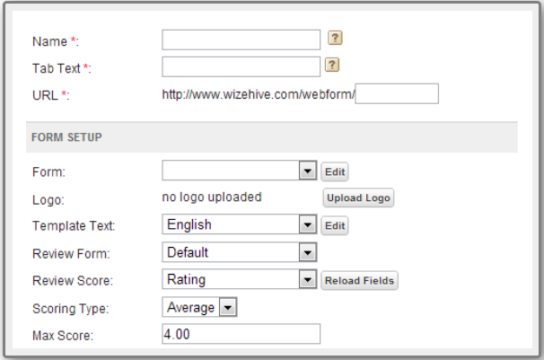

## CSS

1. slide 5 (review CSS) ให้สร้าง review.html แสดงเป็นตาราง

   1. CSS syntax ประกอบด้วยอะไรบ้าง
   2. การเขียน CSS มีกี่แบบอะไรบ้าง
   3. selector มีกี่แบบอะไรบ้าง
   4. combinator มีกี่แบบอะไรบ้าง
      > [CSS](./reviewCSS.html)

2. Slide 7 (review CSS)

   1. property และ value คืออะไรแตกต่างกันอย่างไร
   2. property ที่สอนใน precamp มีกี่กลุ่มอะไรบ้าง
   3. value unit มีกี่ประเภทอะไรบ้างแต่ละ ประเภทคืออะไร
      > [Property](./reviewProperty.html)

3. slide 10 ให้สร้างตารางตามรูปด้านล่าง  
   

   > [CSS Layout](./slide10.html)

4. slide 15 (review CSS)

   1. value ใน display property มีอะไรบ้าง
   2. grid และ flex แตกต่างกันอย่างไร
   3. justify and align แตกต่างกันอย่างไร
      > [Display](./reviewDisplay.html)

5. silde 16 (review CSS)

   1. position คืออะไร และ อะไรบ้าง
   2. z-index คืออะไรใช้อย่างไร
      > [Position](./reviewPosition.html)

6. slide 17 ให้ทำตามหน้าเว็บนี้
   [nike](https://www.nike.com/th/men?cp=62130418954_search_%7Cth%7CCore%2BBrand%2B-%2BGN%2B-%2BPure%2B-%2BXCategory%2B-%2BNike%2BThailand%2B-%2BTM%2B-%2BGeneral%2B-%2BMens%2BLP%2B-%2BEN_TH%2B-%2BExact%7CGOOGLE%7Cnike&gclid=EAIaIQobChMIj73I0p6-5wIVzBErCh1nGgUNEAAYASAAEgKYlPD_BwE&gclsrc=aw.ds)

   > [Slide17](./slide17)

7. slide 34 media query ให้ทำตาม โจทย์

   1. ให้ตั้งค่า media query 3 ขนาดหน้าจอ
   2. ในหน้าจอแบ่งเป็น 3 ส่วน
      1. มีรูปภาพใหญ่กึ่งกลางจอ
      2. ให้แบ่งหน้าจอ เป็น 1, 2 หรือ 3 คอลัมน์ โดยแต่ละคอลัมน์ต้องมีหัวข้อและมีเนื้อหา
      3. มีข้อความ ที่เป็นหัวข้อและเนื้อหาอยู่ตรงกลางจอ
         > [slide34](./slide34)

8. slide 35 ให้ทำหน้า responsive page ตามตัวอย่างเว็บนี้
   [pimclick](https://www.pimclick.com/contact-digital-agency-bangkok/)

   > [slide35](./slide35)

9. slide 48 animation CSS  
   ลองกำหนด @keyframes แบบ from to  
   ลองกำหนด @keyframes แบบ %  
   ลองกำหนด @keyframes แบบ from to

   1. color
   2. width
   3. border
   4. background-color
   5. position-relative
   6. show and hide
      > [slide48](./slide48)

10. slide 52 animation CSS ให้สร้าง animation ที่มีการใช้ delay และ direction กำหนด direction ทั้งสามแบบเพื่อเปรียบเทียบ

    1. ให้การกำหนดการเคลื่อนจำนวน 5 ครั้ง
    2. ให้กำหนด keyframes เป็น 5 ช่วง
       > [slide52](./slide52)

11. slide 57 animation CSS นำ animation ทั้งมารวมกันด้วย shorthand ใช้ keyframes เป็น % อย่างน้อย 5 ช่วง ให้มีอย่างน้อย 1 animation-iteration-count เป็น infinite

    1. ให้ทำ animation เปลี่ยนสี
    2. ให้ทำ animation show, hide
    3. ให้ทำ animation เคลื่อนที่
       > [slide57](./slide57)
