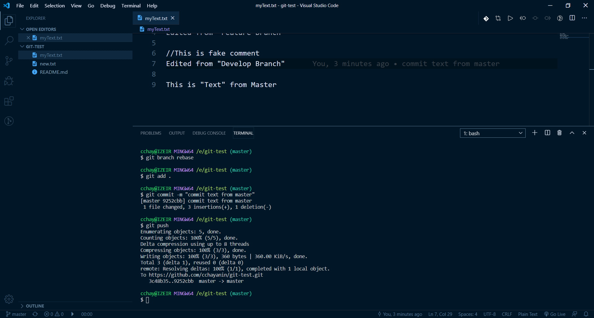

## GIT

1. slide 27 repository ให้สร้าง git repository ใหม่ ขึ้นมาว่า git test ทำการสร้าง folder ที่จะเก็บไฟล์ภายในเครื่อง คลิกขวาที่ folder ที่สร้างขึ้นมาใหม่และรัน git bash

   - ทำการเชื่อม github กับ computer เรา
   - สร้างไฟล์ Readme.md
     > [git test](https://github.com/cchayanin/git-test)

2. slide 34 markdown ให้ลองเขียน markdown file สร้าง README.md ให้ใส่รายละเอียด reprository หรือ ข้อมูลพื้นฐานต่างๆ

   - ใช้คำสั่ง header
   - สร้าง link
   - สร้าง list
   - สร้าง ตัวหนา ตัวเอียง
   - สร้าง `
`
   - สร้าง blockquotes

3. slide 43 git flow

   - ให้ลองเขียน สร้างไฟล์ .txt
   - พิมพ์ข้อความอะไรก็ได้  
     
   - save และ ทำการ add file ขึ้น repository ของเรา
   - เข้าไปเช็คว่าไฟล์ของเราขึ้นไปหรือไม่ที่เว็บ git  
     
   - ลองลบไฟล์ .txt ออก
   - ลอง git restore จาก repo มาที่เครื่องเรา  
     

4. slide 50 git branch

   - สร้าง branch ใหม่ด้วย
   - git branch
   - checkout ไป branch ใหม่
   - สร้าง ไฟล์ .txt
   - แก้ไข ไฟล์ .txt
   - upload file ขึ้น branch ใหม่
   - สลับกลับมา master
   - ดูการเปลี่ยนแปลงที่เกิดขึ้น  
     
   - ลบ branch ด้วย
   - git branch -d branch_name
   - ลอง ใช้คำสั่ง git checkout -b branch_name
   - สร้างไฟล์ .txt upload
   - สลับมา master
   - ดูการเปลี่ยนแปลง  
     

5. slide 56 git merge

   กรณีมี conflict

   - แก้ไข file .txt ใน master  
     
   - push ขึ้น repo
   - สลับไป branch ที่สร้างเมื่อกี้
   - แก้ไข file.txt ให้ไม่เหมือนใน master  
     
   - push ขึ้น repo
   - ทำการ merge เข้ากับ master  
       
     

   กรณี ไม่มี conflict

   - สลับมา branch ใหม่
   - แก้ไขไฟล์ .txt  
     
   - push ขึ้น repo
   - ทำการ merge เข้ากับ master
     
   - อีกรอบ
   - กรณีมี การเพิ่ม comment  
     
   - สลับมา branch ใหม่
   - แก้ไขไฟล์ .txt แบบ comment
   - push ขึ้น repo
   - ทำการ merge เข้ากับ master อีกรอบ  
     

6. slide 65 git rebase

   กรณีมี conflict

   - สร้าง branch ใหม่
   - แก้ไข file .txt ใน master  
     
   - push ขึ้น repo
   - สลับไป branch ที่สร้างเมื่อกี้
   - แก้ไข file.txt ให้ไม่เหมือนใน master  
     
   - push ขึ้น repo
   - ทำการ rebase เข้ากับ master  
       
     

   กรณี ไม่มี conflict

   - สลับมา branch ใหม่
   - แก้ไขไฟล์ .txt  
     
   - push ขึ้น repo
   - ทำการ rebase เข้ากับ master อีกรอบ  
     

7. slide 69 git ignore

   - ลอง สร้างไฟล์ .html, .css, .js
   - push repo  
     
   - ignore ไฟล์ .html  
     
   - git rm --cached file_name
   - push repo  
     
   - edit ignore ไฟล์ .css  
     
   - push repo
   - git rm --chached file_name
   - push repo
     
   - edit ignore ไฟล์ .js  
     
   - push repo
   - git rm --cached file_name
   - push repo  
     
