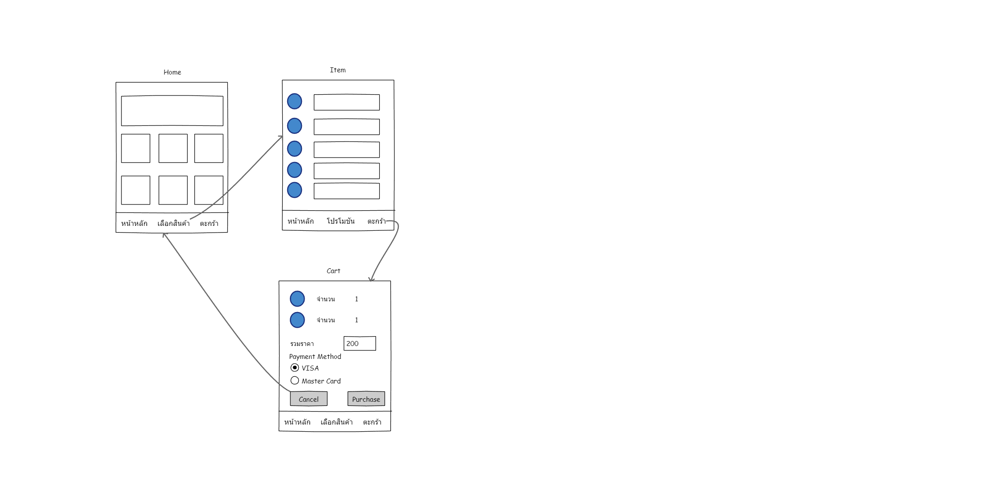

1. หาเว็บไซต์ 1 อัน ให้ครอบคลุม **_มีไม่ครบ 6 ข้อ_**

   - Useful: มีประโยชน์
   - Usable: ใช้งานง่าย
   - Findable: หาสิ่งที่ต้องการได้ง่าย
   - Credible: น่าเชื่อถือ
   - Desirable: น่าใช้
   - Accessible: เข้าถึงได้ง่าย
     > [bloggang](https://www.bloggang.com/)

2. เล่าเรื่องอะไรก็ได้เกี่ยวกับตัวเอง 3 ข้อ โดย 2 ข้อเป็นเรื่องจริง อีก 1 ข้อ เป็นเรื่องโกหก

   > สมัยเรียน ม.ปลาย มีผลการเรียน 1 ใน 20 ลำดับแรกของชั้นเรียน  
   > เคยเป็น คณะกรรมการนักเรียน  
   > จบปริญญาด้วยเกรดเฉลี่ยนมากกว่า 3.00

3. คิดทำ Startup อะไรสักอย่าง **_(Optional !!!)_**
   ขั้นตอน
   Silence Brain Storm - 3 นาที ให้ได้ไอเดียมากที่สุด
   เลือก 1 idea ที่จะนำมาทำกันใน 2 วันนี้

4. เขียน Low-Fidelity Wireframe ลง Post-it หนึ่งแผ่นต่อหนึ่งหน้า

   - เขียนชื่อหน้าจอกำกับด้วย  
     

5. ทำทุกอย่างใหม่ให้เป็น Figma

   > [Figma](https://www.figma.com/file/x9J1oK0uaYDZwaNj14VGm9/cc5-ux-ui-figma)

6. หา Mobile App ที่จะเป็น Inspiration ด้าน design ให้เราได้ อย่างน้อย 3 App

   - Awwwards
   - Dribbble
   - Behance
   - Designspiration
   - Pinterest
     พยายามดูทุกหน้า ว่าเค้ามี Function อะไรบ้าง และชอบ สีหรือ DEsign ตรงไหน ลองเปรียบเทียบดูว่าจะเอามาเพิ่มลดกับของเราหรือไม่ ไป Capture มาแปะ ใน Slides
     > [Inspiration](https://docs.google.com/presentation/d/1UqqKXoQc5CvIUJn3CVf5hUe0zacky6ngpEOZaJu2glM/edit?usp=sharing)

7. ทำ Moodboard ใส่ Figma ใส่เป็นอีก File

   หัวข้อครอบคลุม

   - color palette
   - fonts (1 to 3 per mood board)
   - photography/illustration style
   - iconography (if needed)
   - navigation style
   - spatial awareness (or, white space usage)

> [Moodboard](https://docs.google.com/presentation/d/1nmcrzJWSBoQOxRg49WLvr-VJq9YVKEKZGo09neLNcXI/edit?usp=sharing)
